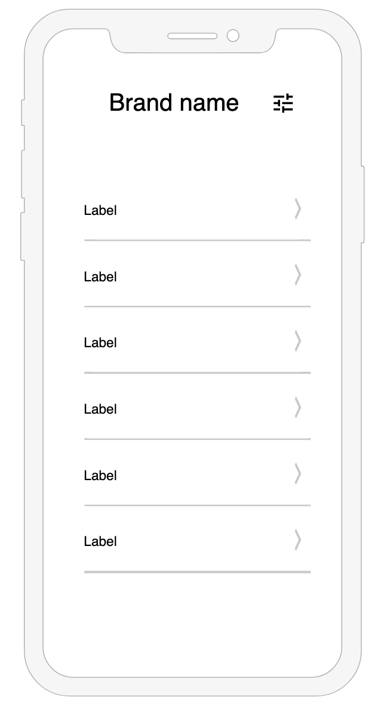
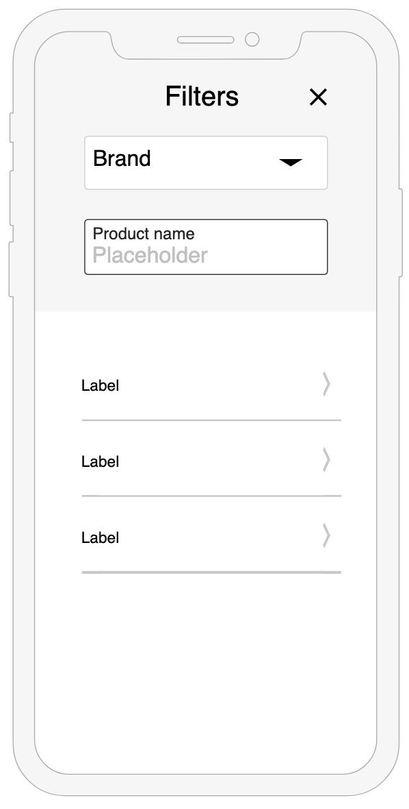
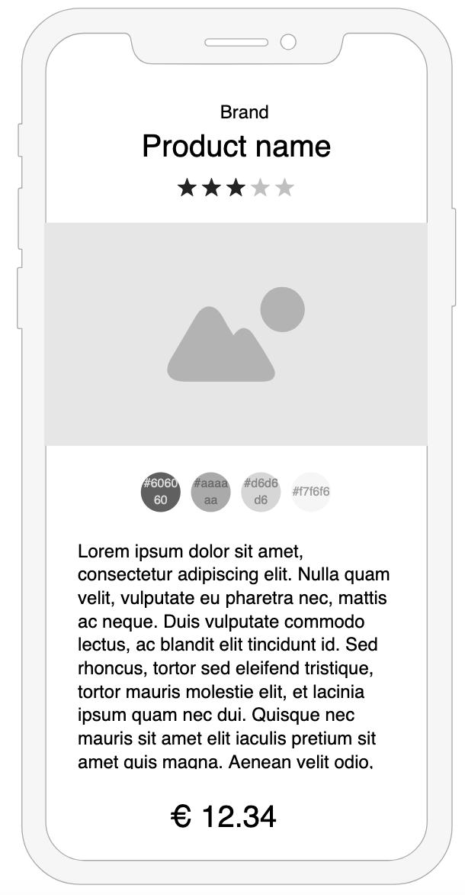

# The Beauty List

## Introduction

A simple Webapp that consumes data from the [MakeUp Api](https://makeup-api.herokuapp.com/).
This app consist of two pages:

1. List Page
2. Detail Page

### Page 1 - List Page

The list page contains two main components:

- Filter bar
- List of products.

<table>
  <tr>
    <td>
      
    </td>
    <td>
      
    </td>
  </tr>
</table>

##### The Filter bar

The filter bar is used to filter the products in the list, it consists of two inputs:

- **Combobox**: used to filter by brand
- **Text input**: used to filter by product name.

Both filter functionalities happen in realtime as the user changes the inputs.

##### The List

Is a list of products, it can display only the products from **ONE** specific brand at the time,
therefore a brand must be selected before the list displays any contents.

If the filter does not return any products, a text stating "No products to be displayed" is displayed. Each Item in the list includes the name and price of the product.
When the user clicks on a list item the application redirects to the detail page of the choosen product.

### Page 2 - Detail Page

The detail Page contains all the information from the Api about the selected product
(including the picture). Each product has its own unique URL and the detail page can be reached directly by entering its url in the browser.

## Technical implementation

The App is developed with a mobile first approach, it is written in [React](https://reactjs.org/), bootstrapped with [Create React App](https://create-react-app.dev/), interface components from [Semantic-UI](https://react.semantic-ui.com/) and for state management [Redux](https://redux.js.org/) is used alogn with [Redux Toolkit](https://redux-toolkit.js.org/).

[Travis](https://travis-ci.org/github/jvitela/coding-challenge) is used for continuous integration
and [AWS Amplify](https://aws.amazon.com/amplify/) is used for continuous deployments.

#### Minimum Requirements

Node.js version 10.13.0
NPM version 6.14.4
Chrome version 84.0.4147.105

### Installation

In the project directory, run:
`npm install`

### Run the app in development mode

In the project directory, run: `npm start`.

### Launch the test runner in the interactive watch mode.

In the project directory, run: `npm test`. See the section about [running tests](https://facebook.github.io/create-react-app/docs/running-tests) for more information.

### Builds the app for production

In the project directory, run: `npm run build`, the assets are saved to the `build` folder.
It correctly bundles React in production mode and optimizes the build for the best performance.
The build is minified and the filenames include the hashes.

### Version Control and CI/CD

There is one main branch called "master" that contains the latest working version.
Additional branches were used during development to add new features, fix issues or make refactors, after the work is done, a pull request is opened and if all the tests pass (using Travis), the changes are merged to the main branch and the feature branch is closed. Once a new comit is made to the main branch, AWS Amplify automatically builds and deploys the application.

You can review previous requests in the [Pull requests](https://github.com/jvitela/coding-challenge/pulls?q=) section.
